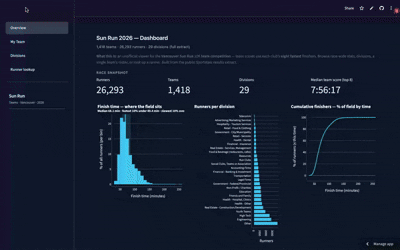

# Vancouver Sun Run — Team results (2026)

**Live app:** [https://vancouver-sunrun-teams-2026.streamlit.app/](https://vancouver-sunrun-teams-2026.streamlit.app/) — open in your browser, no install required.

Every spring, thousands of people run the **Vancouver Sun Run 10K**. Clubs and companies enter **teams**: your team time is the sum of each squad’s **eight fastest** finishers. That’s a lot of names, divisions, and times — so this little app exists to **poke around** the published results without scrolling long raw HTML lists.



**What you can do:** skim the whole field on **Overview**, zoom into **one team** and see who counts for the score, compare **divisions**, or **look up** a runner by name. It’s a **Streamlit** dashboard on the same public data.

---

### Run it

```bash
conda env create -f sunrun.yml && conda activate sunrun
streamlit run app.py
```

---

### Where the numbers come from

Results are published by **Sportstats** — [10K leaderboard](https://sportstats.one/event/vancouver-sun-run/leaderboard/146265), [2026 team page](https://cdn-1.sportstats.one/SunRun2026_Teams.htm). This repo ships with CSVs under `data/processed/`. To **rebuild** them, open `notebooks/sunrun_extract.ipynb` from the **repo root** (so paths line up); it pulls the HTML, runs `sunrun_parse.py`, and writes categories, teams, and runners. The dashboard only reads those files — no live API calls when you click around.

---

### Contributing

Ideas, fixes, and polish are welcome. **Pull requests** and issues are appreciated — open a PR with a short description of what changed and why, and I’ll take a look.

> *App was built with help from Cursor Agents (Composer 2 model).*

---

### Fine print

MIT — [LICENSE](LICENSE). This is an **unofficial** hobby project; for official standings, trust the organiser and Sportstats.